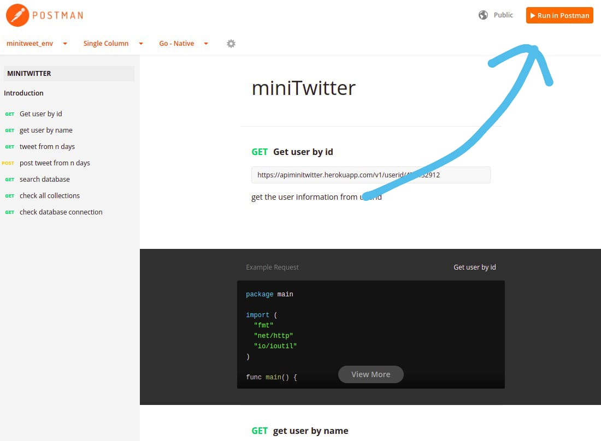

# miniTwitter

## Local development 

* clone the repo

  `git clone https://github.com/JATIN2111999/MiniTwitter.git`

* create a .env file

    BEARER_TOKEN=YOUR_TWITTER_TOKEN

    MONGOURI=YOUR_MONOG_ATLAS_URI

* Run docker

  `docker-compose up --build`

* Access the web application 

  `localhost:5000`

 

## website url
`https://apiminitwitter.herokuapp.com/`

# documentation and api end points 
[documentation](https://documenter.getpostman.com/view/5938078/UVXgKwmd)

## testing the website

## api end points 

* getting user details from user id
  
  `https://apiminitwitter.herokuapp.com/v1/username/tesla`

* getting user details from username
  
  `https://apiminitwitter.herokuapp.com/v1/userid/478432912`

* getting user tweet from last 5 days using the userid
  
  `http://apiminitwitter.herokuapp.com/v1/userid/478432912/5`

* POST request to save data to a collection
   
  `https://apiminitwitter.herokuapp.com/v1/userid/13298072/10`

* search in all db 
  
  `https://apiminitwitter.herokuapp.com/v1/db?search=@google`

* search in a specific collection
  
  `https://apiminitwitter.herokuapp.com/v1/db?search=@google&coll=google10daytweet`

* check all collection and count of document in every collections
  
  `https://apiminitwitter.herokuapp.com/v1/collections`

* check if the db is connected to server
  
  `https://apiminitwitter.herokuapp.com/`
